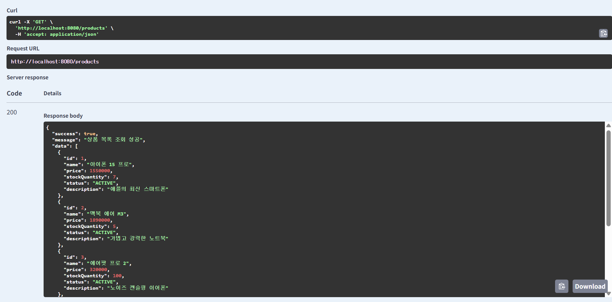
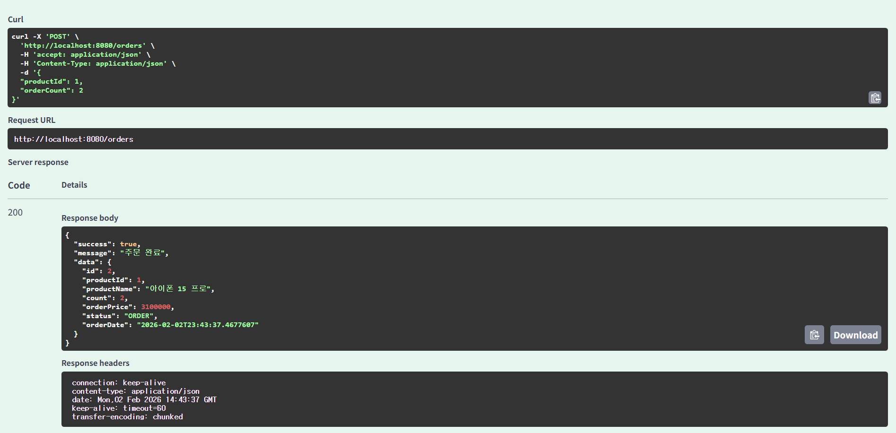
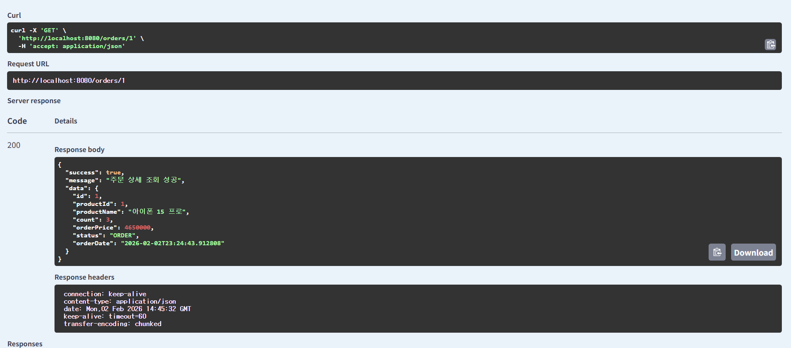
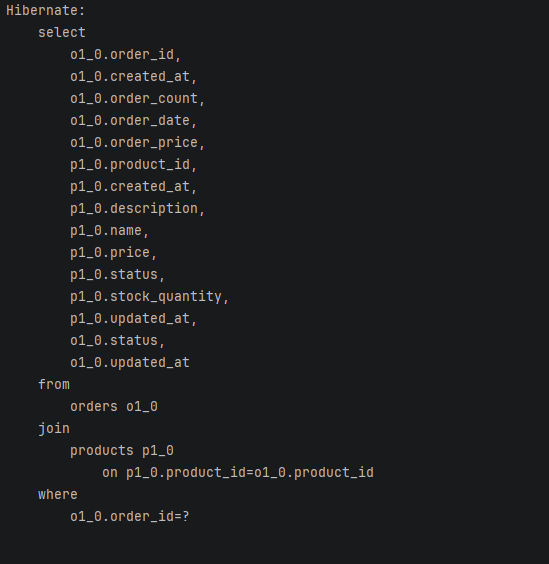

# 🛒 Precamp Shop API

Spring Boot 기반의 상품 및 주문 관리 API 시스템입니다. 본 프로젝트는 **REST API 설계, 엔티티 연관관계, 그리고 계층화된 패키지 구조**를 중심으로 구성되었습니다.

---

## 📦 패키지 구조 (Package Structure)


```text
com.precamp.shop
 ├── 📁 common
 │   ├── ApiResponse             # 공통 응답 규격
 │   ├── BaseEntity              # 등록/수정일 공통 엔티티
 │   ├── GlobalExceptionHandler  # 전역 예외 처리
 │   └── InitDb                  # 테스트 데이터 초기화
 │
 ├── 📁 controller
 │   ├── ProductController       # 상품 API 엔드포인트
 │   └── OrderController         # 주문 API 엔드포인트
 │
 ├── 📁 domain
 │   ├── Product                 # 상품 엔티티 (재고/상태 관리)
 │   ├── Order                   # 주문 엔티티 (생명주기 관리)
 │   └── 📁 status               # 도메인 상태값 (Enum)
 │
 ├── 📁 dto
 │   ├── 📁 product                 # 상품 관련 DTO
 │   └── 📁 order                   # 주문 관련 DTO
 │
 ├── 📁 exception
 │   └── BusinessException       # 커스텀 비즈니스 예외들
 │
 ├── 📁 repository
 │   ├── ProductRepository       # 상품 데이터 접근
 │   └── OrderRepository         # 주문 데이터 접근
 │
 ├── 📁 service
 │   ├── ProductService          # 상품 비즈니스 로직
 │   └── OrderService            # 주문 비즈니스 로직
 │
 └── ShopApplication             # 메인 실행 클래스
```

---

## 🔗 엔티티 연관관계 (Entity Relationship)

### Product ↔ Order (1:N)

-   **Product (One)**
    -   하나의 상품은 여러 주문을 가질 수 있습니다.
    -   재고(stockQuantity)와 상태(ProductStatus)를 관리합니다.
    -   **논리 삭제(Soft Delete)** 방식(DELETED)으로 데이터를 보존합니다.
-   **Order (Many)**
    -   주문은 하나의 상품에만 속합니다. (ManyToOne)
    -   주문 생성/수정/취소 시 **상품 재고를 직접 제어**합니다.
    -   주문 상태(ORDER, CANCEL)로 생명주기를 관리합니다.

---

## ⚡ 주요 성능 최적화 및 동시성 제어

### 1\. N+1 문제 해결 (Fetch Join)

주문 목록 조회 및 상세 조회 시, 연관된 Product 엔티티를 함께 조회할 때 발생하는 성능 저하 문제를 해결했습니다.

-   **문제**: 기본 조회 시 주문 건수만큼 상품 조회 쿼리가 발생하는 N+1 문제 발생.
-   **해결**: OrderRepository에서 join fetch를 사용하여 단 한 번의 쿼리로 주문과 상품 정보를 함께 조회하도록 최적화했습니다.

```java
    //OrderRepository.java
    
    @Query("select o from Order o join fetch o.product")
    List<Order> findAll();
    
    @Query("select o from Order o join fetch o.product where o.id = :id")
    Optional<Order> findById(@Param("id") Long orderId);
    boolean existsByProductId(Long productId);
```    

### 2\. 재고 정합성 보장 (Pessimistic Lock)

동시에 여러 사용자가 같은 상품을 주문할 경우 발생할 수 있는 레이스 컨디션(Race Condition)을 방지합니다.

-   **해결**: 상품 조회 시 비관적락(PESSIMISTIC\_WRITE)을 사용하여, 트랜잭션이 완료될 때까지 다른 트랜잭션의 접근을 제어하고 정확한 재고 차감을 보장합니다.
-   **비관적 락 선정 이유** : 주문 시스템은 동시 접근이 빈번하므로 비관적 락으로 순차 처리하여 재고 정합성을 보장하기에 용이했습니다. 낙관적락의 경우 충돌 시 재시도 부담이 크게 때문에 이 경우에는 부적합하다고 판단했습니다. 
```java
//OrderService.java
private Product getProduct(Long productId) {
    return productRepository.findByIdWithLock(productId)
            .orElseThrow(() -> new ProductNotFoundException(productId));
}

//ProductRepository.java
@Lock(LockModeType.PESSIMISTIC_WRITE)
@Query("SELECT p FROM Product p WHERE p.id = :id AND p.status != 'DELETED'")
Optional<Product> findByIdWithLock(@Param("id") Long id);
```
---

## 🌐 API 엔드포인트

### 📦 Product API (상품 관리)

| **Method** | **Endpoint** | **Description** |
| --- | --- | --- |
| GET | /products | 전체 상품 목록 조회 |
| GET | /products/{id} | 상품 상세 정보 조회 |
| POST | /products | 신규 상품 등록 |
| PATCH | /products/{id} | 상품 정보 수정 |
| DELETE | /products/{id} | 상품 논리 삭제 (DELETED) |

### 🧾 Order API (주문 관리)

| **Method** | **Endpoint** | **Description** |
| --- | --- | --- |
| GET | /orders | 전체 주문 목록 조회 |
| GET | /orders/{id} | 주문 상세 정보 조회 |
| POST | /orders | 주문 생성 (재고 차감) |
| PATCH | /orders/{id} | 주문 수량 변경 |
| DELETE | /orders/{id} | 주문 취소 (재고 복구) |

---

## 🖼 Swagger / Postman API 실행 결과

| **기능** | **실행 결과 (스크린샷)** | 실행 SQL |
| --- | - | - |
| **상품 목록 조회** | |   |
| **주문 생성 (재고 차감)** |  |   |
| **주문 상세 조회 (Fetch Join 적용)** |  |  |

---

## 📌 설계 포인트

-   **도메인 중심 설계**: 재고 차감 및 복구 로직을 엔티티 내부에 구현하여 응집도를 높였습니다.
-   **안정적인 응답**: ApiResponse를 통해 모든 API 응답 형식을 통일했습니다.
-   **데이터 보존**: Soft Delete를 적용하여 삭제 시 실제 데이터를 지우지 않고 상태값만 변경합니다.
-   **데이터 무결성**: 비관적 락과 Fetch Join을 통해 성능과 데이터 정확성을 동시에 확보했습니다.

---

## 🚀 기술 스택

-   **Framework**: Spring Boot 3.4.2
-   **Language**: Java 17
-   **ORM**: Spring Data JPA (Hibernate)
-   **Database**: H2 (In-memory)
-   **Library**: Lombok, Jakarta Validation